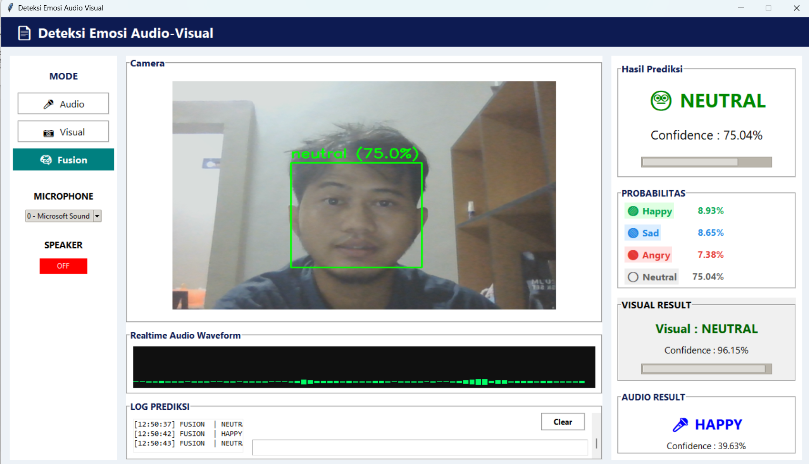
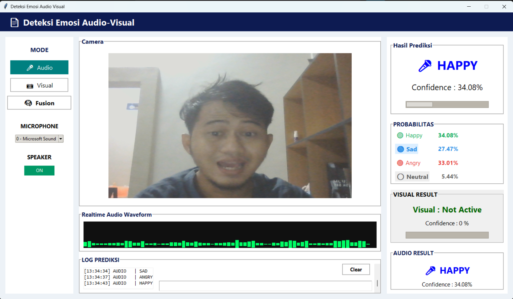
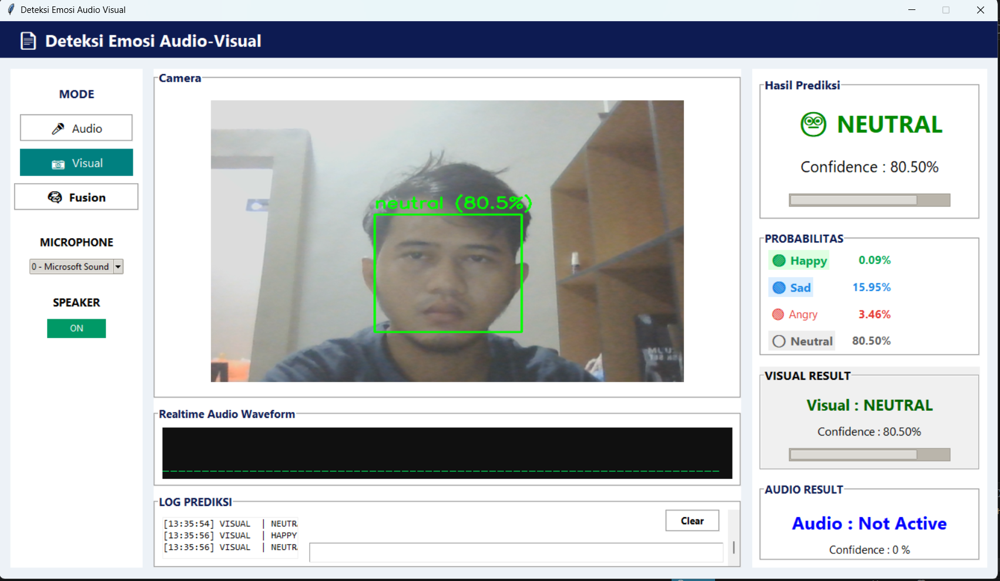
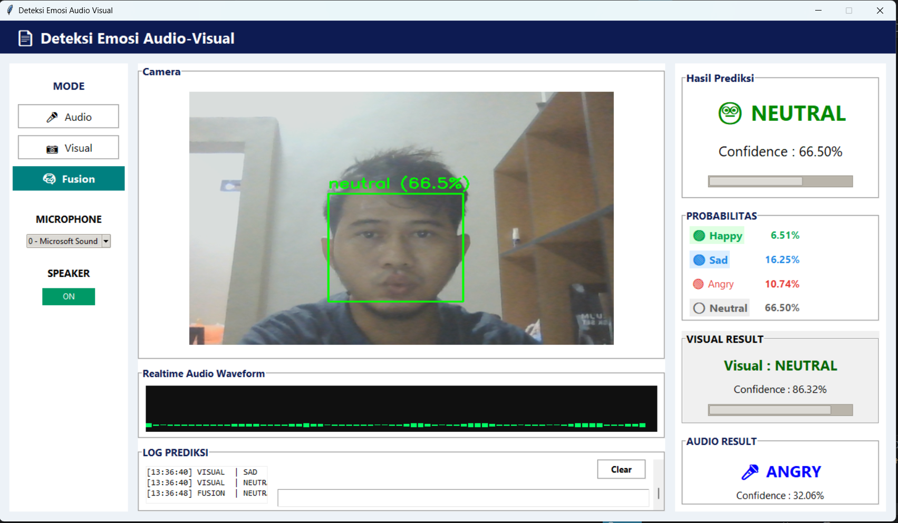
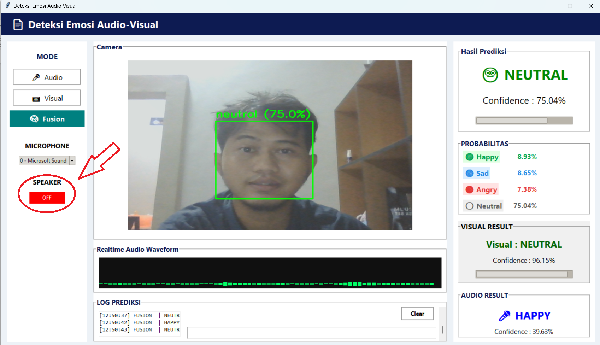

# 🎭 Sistem Deteksi Emosi Manusia Menggunakan Metode Audio-Visual Berbasis MFCC, Random Forest, dan CNN

## 📖 Deskripsi

Sistem Deteksi Emosi Manusia merupakan aplikasi berbasis Python yang dirancang untuk mengenali emosi manusia secara **real-time** menggunakan kombinasi informasi **audio** dan **visual**.

Penelitian ini mengintegrasikan beberapa metode, yaitu:

- 🎤 **Mel-Frequency Cepstral Coefficients (MFCC)** sebagai metode ekstraksi fitur suara.
- 🌳 **Random Forest** sebagai algoritma klasifikasi emosi berdasarkan suara.
- 😊 **Convolutional Neural Network (CNN)** sebagai algoritma klasifikasi emosi berdasarkan ekspresi wajah.
- 🔀 **Weighted Late Fusion (Decision-Level Fusion)** untuk menggabungkan hasil prediksi audio dan visual sehingga menghasilkan keputusan emosi yang lebih stabil.

Sistem mampu mengenali empat kategori emosi, yaitu:

- 😄 Happy (Senang)
- 😠 Angry (Marah)
- 😢 Sad (Sedih)
- 😐 Neutral (Netral)

---

# 🎯 Latar Belakang

Pengenalan emosi manusia merupakan salah satu bidang penting dalam **Human Computer Interaction (HCI)**. Kemampuan sistem dalam memahami kondisi emosional pengguna dapat meningkatkan kualitas interaksi antara manusia dan komputer.

Pada penelitian ini dikembangkan sistem deteksi emosi berbasis **audio-visual** yang memanfaatkan suara dan ekspresi wajah secara bersamaan sehingga diharapkan mampu memberikan hasil deteksi yang lebih akurat dibandingkan penggunaan satu modalitas saja.

---

# ✨ Fitur Utama

- 🎤 Deteksi emosi berbasis Audio (MFCC + Random Forest)
- 📷 Deteksi emosi berbasis Visual (CNN)
- 🔀 Mode Fusion Audio-Visual
- ⚡ Deteksi emosi secara Real-Time
- 😊 Menampilkan hasil prediksi emosi
- 📊 Menampilkan Confidence Score
- 🎯 Bounding Box Detection
- 🎙️ Pemilihan Microphone
- 🔊 Speaker ON / OFF
- 📜 Riwayat Prediksi

---

# 🧠 Metode Penelitian

## Audio Processing

1. Akuisisi suara menggunakan microphone.
2. Preprocessing audio.
3. Ekstraksi fitur menggunakan MFCC.
4. Normalisasi fitur menggunakan StandardScaler.
5. Klasifikasi menggunakan Random Forest.

---

## Visual Processing

1. Akuisisi citra menggunakan webcam.
2. Deteksi wajah menggunakan Haar Cascade.
3. Preprocessing citra wajah.
4. Klasifikasi menggunakan CNN.

---

## Audio-Visual Fusion

Prediksi audio dan visual digabungkan menggunakan metode **Weighted Late Fusion (Decision-Level Fusion)** sehingga menghasilkan keputusan emosi yang lebih stabil.

---

# 📂 Dataset

## Dataset Audio

**RAVDESS (Ryerson Audio-Visual Database of Emotional Speech and Song)**

Kategori emosi yang digunakan:

- Angry
- Happy
- Neutral
- Sad

---

## Dataset Visual

**FER2013 (Facial Expression Recognition 2013)**

Kategori emosi yang digunakan:

- Angry
- Happy
- Neutral
- Sad

---

# 📁 Struktur Project

```text
Sistem-Deteksi-Emosi-Manusia/
│
├── docs/
│   ├── Buku Manual Aplikasi_.docx
│   ├── gui_app.png
│   ├── tampilan_menu_utama.png
│   ├── mode_Audio.png
│   ├── mode_Visual.png
│   ├── mode_Fusion.png
│   └── output_speaker.png
│
├── models/
│   ├── audio_scaler.pkl
│   ├── rf_audio_mfcc.pkl
│   ├── cnn_visual_strong.h5
│   ├── haarcascade_frontalface_default.xml
│   └── speaker.png
│
├── results/
│   ├── confusion_matrix_audio.png
│   └── confusion_matrix_visual.png
│
├── sounds/
│   ├── angry.wav
│   ├── happy.wav
│   ├── neutral.wav
│   └── sad.wav
│
├── audio_engine.py
├── visual_engine.py
├── fusion_engine.py
├── gui_app_v2.py
├── audio_train.py
├── visual_train.py
├── requirements.txt
└── README.md
```

---

# 💻 Kebutuhan Sistem

## Hardware

- Laptop / PC
- Processor Intel Core i3 atau lebih tinggi
- RAM minimal 4 GB
- Webcam
- Microphone
- Speaker

---

## Software

- Windows 10 / Windows 11
- Python 3.10
- Visual Studio Code

---

# ⚙️ Instalasi

## Clone Repository

```bash
git clone https://github.com/afifyusuf055/Sistem-Deteksi-Emosi-Manusia-menggunakan-metode-Audio-Visual-berbasis-MFCC-Random-Forest-dan-CNN.git
```

Masuk ke folder project

```bash
cd Sistem-Deteksi-Emosi-Manusia-menggunakan-metode-Audio-Visual-berbasis-MFCC-Random-Forest-dan-CNN
```

Install dependency

```bash
pip install -r requirements.txt
```

---

# ▶️ Menjalankan Program

## Menjalankan GUI

```bash
python gui_app_v2.py
```

## Training Model Audio

```bash
python audio_train.py
```

## Training Model Visual

```bash
python visual_train.py
```

---

# 📊 Hasil Penelitian

| Model | Metode | Hasil |
|--------|---------|--------|
| Audio | MFCC + Random Forest | **Akurasi 75.56%** |
| Visual | CNN (FER2013) | **Akurasi 87.48%** |
| Fusion | Weighted Late Fusion | **Deteksi lebih stabil secara real-time** |

---

# 🖥️ Tampilan Sistem

GUI menyediakan beberapa fitur berikut:

- ✅ Mode Audio
- ✅ Mode Visual
- ✅ Mode Fusion
- ✅ Real-Time Detection
- ✅ Confidence Score
- ✅ Bounding Box Wajah
- ✅ Pemilihan Microphone
- ✅ Speaker ON / OFF
- ✅ Riwayat Prediksi

---

# 📸 Screenshot Aplikasi

## Tampilan Menu Utama



---

## GUI Utama


---

## Mode Audio



---

## Mode Visual



---

## Mode Fusion



---

## Pengaturan Speaker



---

# 🔄 Alur Sistem

```text
               Microphone
                    │
                    ▼
                  MFCC
                    │
                    ▼
            Random Forest
                    │
                    ▼
            Audio Prediction
                    │
                    ├────────────────┐
                    │                │
                    ▼                ▼
                Webcam             CNN
                    │                │
                    ▼                ▼
          Visual Prediction
                    │
                    ▼
       Weighted Late Fusion
                    │
                    ▼
          Final Emotion Output
```

---

# 🛠️ Teknologi yang Digunakan

- Python
- TensorFlow
- OpenCV
- Scikit-learn
- Librosa
- NumPy
- Tkinter
- Joblib
- SoundDevice
- Matplotlib

---

# 📚 Dokumentasi

📄 **Buku Manual Aplikasi**

[Buka Buku Manual](docs/Buku%20Manual%20Aplikasi_.docx)

Dokumentasi meliputi:

- Panduan instalasi aplikasi
- Cara menjalankan sistem
- Mode Audio
- Mode Visual
- Mode Fusion
- Pengaturan Speaker
- Troubleshooting

---

# 👨‍💻 Pengembang

**M. Afif Fuadie Yusuf**

Program Studi Teknik Mekatronika  
Politeknik Negeri Batam

**Tugas Akhir 2026**

---

# 📄 Lisensi

Project ini dikembangkan sebagai bagian dari penelitian **Tugas Akhir Program Studi Teknik Mekatronika Politeknik Negeri Batam**.

Copyright © 2026  
**M. Afif Fuadie Yusuf**

---

⭐ **Jika repository ini bermanfaat, silakan berikan Star ⭐ pada repository ini.**
